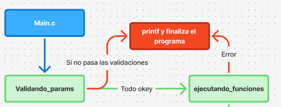

<div align="right">

</div>

# TDA LISTA

## Alumno: Luca Frisoni - 113497 - lfrisoni@fi.uba.ar

- Para compilar:

```bash
makefile compilar
```

- Para ejecutar:

```bash
./programa
```

- Para ejecutar con valgrind:

```bash
makefile valgrind
```

---

## Funcionamiento

Una vez generado el ejecutable, si se lo ejecuta **sin parámetros**, se mostrará un mensaje inicial en consola explicando la forma correcta de uso, los parámetros que admite y algunos consejos de ejecución.

### 1. Validación de parámetros

Antes de ejecutar cualquier operación, se invoca la función:

```c
int validando_params(int argc, char *argv[]);
```

**📌Esta función se encarga de:**

- 🔹 Verificar que se haya pasado al menos un archivo **.csv**.
- 🔹 Validar que la operación solicitada (`buscar`, `mostrar`, `union`, `interseccion`, `diferencia`) sea correcta.
- 🔹 Chequear que la cantidad de parámetros sea la adecuada para cada operación.
- 🔹 Confirmar que los parámetros adicionales tengan el formato esperado (ej: `nombre|id`, `archivo.csv`).
- 🔹 Mostrar mensajes de error claros en caso de que falten argumentos o haya más de los necesarios.

⚠️ Si la validación falla, el programa termina sin ejecutar el flujo principal.



Cuando se lo ejecuta con los parámetros correspondientes, la función principal que gestiona el flujo del programa es:

```c
int ejecutando_funciones(int argc, char *argv[]);
```

### 2.Flujo de Ejecución

### 2.1 Lectura principal (según `argv[1]`)

Se realiza la lectura de un archivo **.csv** cuya ubicacion fue pasado por parametro con `tp1_leer_archivo()`.

```c
tp1_t *tp1_leer_archivo(const char *nombre);
```

**📌Esta funcion se encarga de:**

- 🔹 Manejar la apertura del archivo **.csv**📑 con `manejador_de_archivos_open()`
- 🔹 Crear la estructura **tp1_t**.
- 🔹 Leer y validar todas las lineas del archivo (se lee dinamicamente) con `leer_linea()`.
- 🔹 Transforma la linea de texto en un tipo pokemon **struct pokemon** si es valido con `parsear_pokemon()` y demas funciones internas.
- 🔹 Agregar el pokemon parseado a la estructrua **tp1_t** con `agregar_pokemon()`.
- 🔹 Ordenar ascendemente los pokemones por id una vez finalizada la lectura completa del archivo con `bubbleSort_pokemones_id_asc_optimizado()`.
- 🔹 Correcta liberacion de memoria y cierre de archivos.
- 🔹 Retorno de la estructura con los pokemones y su cantidad.

- ⚠️ En caso de que el archivo no respete el formato, no se pueda abrir o falle la reserva de memoria, la función devuelve `NULL`.


### 2.2 Selección de operación (según `argv[2]`)

El sistema permite al usuario elegir entre varias operaciones predefinidas.

#### 🔍 buscar

```c
struct pokemon *tp1_buscar_nombre(tp1_t *tp, const char *nombre);
```

```c
struct pokemon *tp1_buscar_id(tp1_t *tp, int id)
```


**Parámetros:** `<tipo_busqueda> <valor>`

- 🔹Permite buscar un Pokémon en el archivo:
  - `nombre`: busca por nombre con `tp1_buscar_nombre()`.
  - `id`: busca por ID con `tp1_buscar_id()`.
- 🔹Si lo encuentra, se muestra con `mostrar_pokemon()`.
- 🔹Si no existe, devuelve **NULL** e imprime que no fue encontrado

---

#### 📑 mostrar


**Parámetros:** `<tipo_mostrar>`

- Permite mostrar todos los Pokémon ordenados:
  - 🔹Por `nombre` en orden ascendente.
  - 🔹Por `id` en orden ascendente.
- Luego se imprime la lista completa con `mostrar_pokemon()` llamando al iterador interno `tp1_con_cada_pokemon()`.

---

#### 📂 union | 🔗 interseccion | ➖ diferencia

```c
tp1_t *tp1_union(tp1_t *un_tp, tp1_t *otro_tp);
```

```c
tp1_t *tp1_interseccion(tp1_t *un_tp, tp1_t *otro_tp);
```

```c
tp1_t *tp1_diferencia(tp1_t *un_tp, tp1_t *otro_tp);
```


**Parámetros:** `<archivo2.csv> <resultado.csv>`

**Segun la operacion:**

- 🔹Combina dos colecciones de Pokémon (`tp1_union`).
- 🔹Obtiene los Pokémon que están presentes en ambos archivos (`tp1_interseccion`).
- 🔹Obtiene los Pokémon que están en el primer archivo pero no en el segundo (`tp1_diferencia`).

**Proceso comun:**

- 🔹Se crea una nueva estructura **tp1_t** donde seran agregados los pokemones
- 🔹Se realiza una copia de los pokemones con `copiar_pokemones`
- 🔹El resultado se guarda en un archivo nuevo con `tp1_guardar_archivo()`.
- 🔹Se liberan las estructuras auxiliares utilizadas.
- 🔹Se retorna el nuevo tp creado

⚠️ Si alguno de los archivos no se puede abrir, está vacío o se produce un error de memoria, la función devuelve `NULL` y se muestra un mensaje de error.

---

### 3. Liberación de Memoria

Al finalizar cualquier operación se llama a `tp1_destruir()`:

```c
void tp1_destruir(tp1_t *tp1);
```

- 🔹Se libera la memoria asociada a los **nombres** de cada Pokémon.
- 🔹Se libera cada **Pokemon**
- 🔹Se libera el **vector dinámico** de direcciones de memoria de pokemones.
- 🔹Se libera la **estructura principal `tp1_t`**.

_Esto garantiza que no haya fugas de memoria_

## Estructura del Proyecto

La lógica general del programa se organiza en **dos módulos principales**:

---

### 1. `tp1.c` / `tp1.h`

Aquí se definen:

- 🔹La estructura **`struct pokemon`**.
- 🔹El enum **`tipo_pokemon`**.
- 🔹La estructura **`struct tp1`**
- 🔹Funciones primarias para inicialización y manejo de estas estructuras.

El archivo `tp1.h` actúa como **interfaz pública** para que otros módulos puedan usar estas funciones.

En el informe ya se describieron en detalle varias de estas funciones; las restantes, que también forman parte de la interfaz, son:

```c
size_t tp1_cantidad(tp1_t *tp1);
```

**📌Esta funcion se encarga de**:

- 🔹Retornar 0 si no se le pasa ningun **`tp1_t`**
- 🔹Retornar la **cantidad de pokemones** en la estructura

```c
tp1_t *tp1_guardar_archivo(tp1_t *tp1, const char *nombre);
```

**📌Esta funcion se encarga de**:

- 🔹📝Inicializar un nuervo archivo
- 🔹🐾Escribir los pokemones dentro de ese archivo en formato csv

⚠️ Si alguno de los archivos no se puede abrir, está vacío o se produce un error de memoria, la función devuelve `NULL`

```c
size_t tp1_con_cada_pokemon(tp1_t *un_tp, bool (*f)(struct pokemon *, void *),
			    void *extra);
```

**📌Esta funcion**:

- 🔹🔁 Es un iterador interno que recorre cada elemento de la estructura
- 🔹✅ Aplica la función pasada como segundo parámetro
- 🔹⛔ Cuando la función devuelve false, se detiene la iteración
- 🔹📊 Retorna la cantidad de pokemones a los cuales se aplicó la función
- 🔹🎯 El último parámetro (extra) permite indicar un comportamiento particular

---

### 2. `main.c`

Es el **punto de entrada del programa**.  
Se encarga de:

- 🔹Validar los parámetros pasados por línea de comando.
- 🔹Mostrar el mensaje inicial si la ejecución no respeta el formato.
- 🔹Llamar a las funciones correspondientes según la operación pedida (`buscar`, `mostrar`, `union`, `interseccion`,`diferencia`).

## Funciones Interesantes a mencionar

- **`resize_buffer(char *buffer, size_t *capacidad)`** → duplica el tamaño del buffer dinámico, devuelve NULL en caso de error.

  

## Tests Unitarios

Esta sección describe cómo se verifican todas las funciones primitivas del proyecto mediante pruebas unitarias y de estrés.

### Objetivo

- 🔹Comprobar que cada función del proyecto se ejecute correctamente en distintos escenarios.
- 🔹Asegurar que las operaciones sobre las estructuras dinámicas se realicen sin errores de memoria.
- 🔹Validar la correcta lectura y escritura de archivos CSV.
- 🔹Confirmar que las funciones de búsqueda, ordenamiento y operaciones de conjuntos (unión, intersección, diferencia) devuelvan los resultados esperados.
- 🔹Asegurarse el buen funcionamiento en casos demandantes

### Cobertura de pruebas

Se realizan **48 pruebas unitarias** que incluyen:

- 🔹**Lectura de archivos CSV**: validar parseo correcto de líneas y manejo de errores.
- 🔹**Pruebas de creacion**: crear los archivos correctamente.
- 🔹**Operaciones de conjuntos**: unión, intersección y diferencia entre listas de Pokémon.
- 🔹**Búsqueda**: por nombre e ID.
- 🔹**Pruebas de iteracion**:
- 🔹**Pruebas de combinacion de funciones**:

### Compilación y ejecución de tests

Para compilar los tests:

```bash
makefile compilar_t
```

Para ejecutar los tests:

```bash
./tests
```

- Para ejecutar con valgrind:

```bash
makefile valgrind_t
```

## Respuestas a las preguntas teóricas

### 1. Elección de la estructura

Para implementar la funcionalidad pedida, se eligió una estructura con dos propiedades:

- 1. Vector dinamico de direcciones de memoria de Pokemones
- 2. Cantidad de pokemones dentro del vector


### 2. Diagramas

Podés ver el diagrama completo en FigJam en el siguiente enlace de asi desearlo:  
[Abrir diagrama en FigJam](https://www.figma.com/board/vowX8Y9YeQB6TmmbxEd99t/TP1?node-id=0-1&t=AGoofdv76DWUrmTd-1)
Hay 2 diagrmas:
✅Diagrma de flujo
✅Diagrama de memoria y estructura

### 3. Complejidad computacional de las funciones (`tp1.c`)

- **`tp1_leer_archivo`** → O(n)

- **`tp1_guardar_archivo`** → O(n)

- **`tp1_union`** → O(n+m)

- **`tp1_interseccion`** → O(n+m)

- **`tp1_diferencia`** → O(n+m)

- **`tp1_buscar_nombre`** → O(n)

- **`tp1_buscar_id`** → O(n)

- **`tp1_con_cada_pokemon`** → O(n)

- **`tp1_destruir`** → O(n)

**Nota:** n corresponde a la cantidad de Pokémon en `tp1->cantidad`.

---

### 4. Dificultades en la implementación del `main`

Al principio me costó comprender completamente las consignas y cómo organizar todo de manera funcional dentro de una aplicación de consola.  
Sin embargo, trabajando función por función y luego integrándolas, con sus respectivas validaciones, logré desarrollar un flujo correcto y robusto.

Las dificultades principales fueron:

- Asegurar que todas las validaciones de parámetros funcionen correctamente antes de ejecutar la operación.
- Manejar memoria dinámica de manera segura y consistente.
- Me complique mucho trayendo complejidad inecesaria
- Optimizacion de funciones ineficientes (En particular la de union)
- Comprender correctamente el encapsulamiento
- No tener Leaks de memoria
