<div align="right">

</div>

# TDA LISTA

## Alumno: Luca Frisoni - 113497 - lfrisoni@fi.uba.ar

- Para compilar:

```bash
gcc main.c src/*.c -o programa
gcc pruebas_alumno.c src/*.c -o tests
```

- Para ejecutar:

```bash
./programa
```

- Para ejecutar con valgrind:

```bash
línea con valgrind
```

---

## Funcionamiento

El programa se compila con `gcc` (o cualquier compilador compatible con C).  
Una vez generado el ejecutable, si se lo ejecuta **sin parámetros**, se mostrará un mensaje inicial en consola explicando la forma correcta de uso, los parámetros que admite y algunos consejos de ejecución.

### 1. Validación de parámetros

Antes de ejecutar cualquier operación, se invoca la función:

```c
int validando_params(int argc, char *argv[]);
```

Esta función se encarga de:

- ✅ Verificar que se haya pasado al menos un archivo **.csv**.
- ✅ Validar que la operación solicitada (`buscar`, `mostrar`, `union`, `interseccion`, `diferencia`) sea correcta.
- ✅ Chequear que la cantidad de parámetros sea la adecuada para cada operación.
- ✅ Confirmar que los parámetros adicionales tengan el formato esperado (ej: `nombre|id`, `archivo.csv`).
- ✅ Mostrar mensajes de error claros en caso de que falten argumentos o haya más de los necesarios.

⚠️ Si la validación falla, el programa termina sin ejecutar el flujo principal.

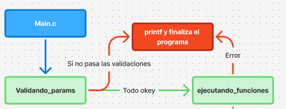

Cuando se lo ejecuta con los parámetros correspondientes, la función principal que gestiona el flujo del programa es:

```c
int ejecutando_funciones(int argc, char *argv[]);
```

### 2.Flujo de Ejecución

### 2.1 Lectura del archivo principal

- Se abre el archivo CSV indicado en `argv[1]`.
- Se cargan los registros en una estructura dinámica `tp1_t`.
- En caso de error al leer el archivo, se muestra un mensaje y el programa finaliza.

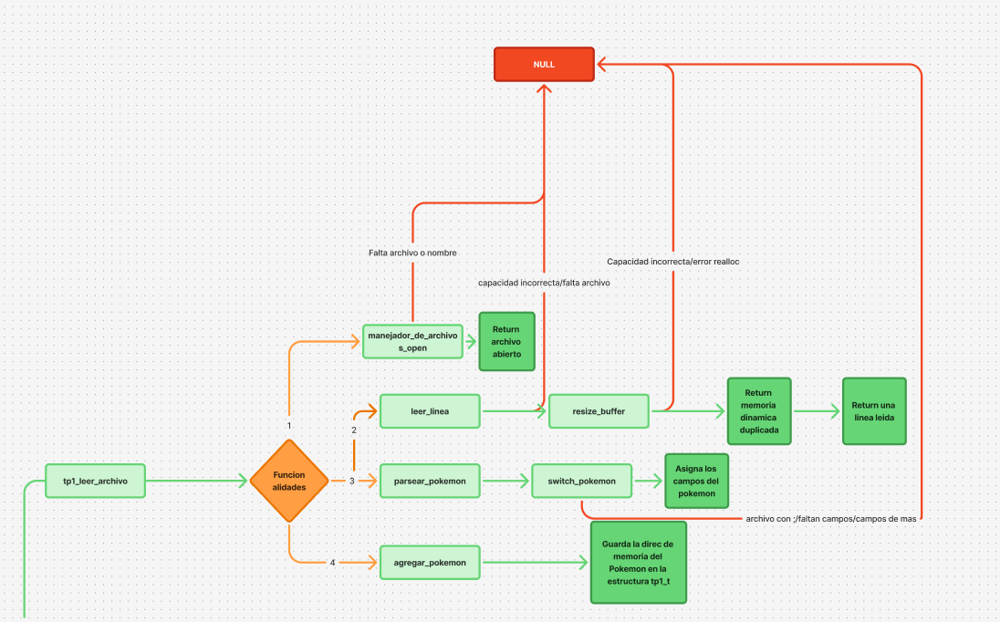

---

### 2.2 Selección de operación (según `argv[2]`)

#### 🔍 buscar

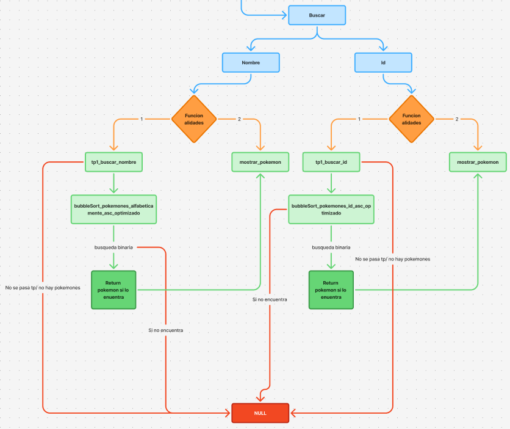

**Parámetros:** `<tipo_busqueda> <valor>`

- Permite buscar un Pokémon en el archivo:
  - `nombre`: busca por nombre con `tp1_buscar_nombre()`.
  - `id`: busca por ID con `tp1_buscar_id()`.
- Si lo encuentra, se muestra con `mostrar_pokemon()`.
- Si no existe, se muestra un mensaje de error.

---

#### 📑 mostrar

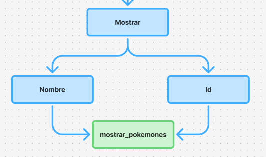

**Parámetros:** `<tipo_mostrar> <asc|desc>`

- Permite mostrar todos los Pokémon ordenados:
  - Los parametros `<asc|desc>` son opcionales
  - Por `nombre` en orden ascendente o descendente usando `bubbleSort_pokemones_alfabeticamente_*`.
  - Por `id` en orden ascendente o descendente usando `bubbleSort_pokemones_id_*`.
- Luego se imprime la lista completa con `mostrar_pokemones()`.

---

#### 📂 union

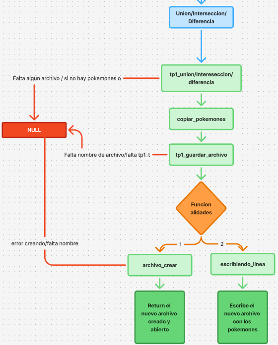

**Parámetros:** `<archivo2.csv> <resultado.csv>`

- Combina dos colecciones de Pokémon (`tp1_union`).
- El resultado se guarda en un archivo nuevo con `tp1_guardar_archivo()`.
- Se liberan las estructuras auxiliares utilizadas.

---

#### 🔗 interseccion

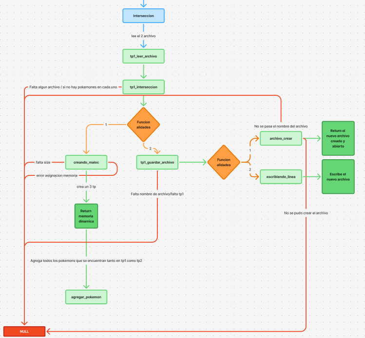

**Parámetros:** `<archivo2.csv> <resultado.csv>`

- Obtiene los Pokémon que están presentes en ambos archivos (`tp1_interseccion`).
- El resultado se guarda en el archivo indicado.
- Se libera la memoria utilizada.

---

#### ➖ diferencia

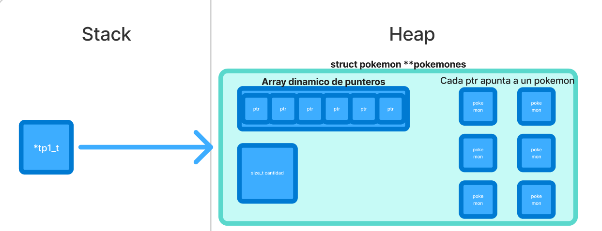

**Parámetros:** `<archivo2.csv> <resultado.csv>`

- Obtiene los Pokémon que están en el primer archivo pero no en el segundo (`tp1_diferencia`).
- El resultado se guarda en el archivo de salida indicado.
- Se liberan las estructuras auxiliares.

---

### 3. Liberación de Memoria

Al finalizar cualquier operación:

- Se libera la memoria asociada a los **nombres** de cada Pokémon.
- Se libera el **vector dinámico** de pokemones.
- Se libera la **estructura principal `tp1`**.

```c
void tp1_destruir(tp1_t *tp1)
{
	for (size_t i = 0; i < tp1->cantidad; i++) {
		free(tp1->pokemones[i].nombre);
	}
	free(tp1->pokemones);
	free(tp1);
};
```

Esto garantiza que no haya fugas de memoria durante la ejecución del programa.

## Estructura del Proyecto

La lógica general del programa se organiza en **tres módulos principales**:

---

### 1. `mis_funciones.c` / `mis_funciones.h`

Contiene las funciones desarrolladas por mí, que encapsulan la lógica de manejo de estructuras y operaciones sobre los datos.  
En el `.h` correspondiente se detalla qué hace cada función, qué parámetros recibe y qué valor retorna.

Estas funciones se apoyan en **memoria dinámica** (`malloc`, `realloc`, `free`) para poder manejar datasets de tamaño variable.

---

#### Funciones de Ordenamiento

- **`bubbleSort_pokemones_alfabeticamente_asc_optimizado(tp1_t *tp1)`**  
  Ordena los Pokémon por nombre en orden ascendente.

- **`bubbleSort_pokemones_alfabeticamente_desc_optimizado(tp1_t *tp1)`**  
  Ordena los Pokémon por nombre en orden descendente.

- **`bubbleSort_pokemones_id_asc_optimizado(tp1_t *tp1)`**  
  Ordena los Pokémon por ID en orden ascendente.

- **`bubbleSort_pokemones_id_desc_optimizado(tp1_t *tp1)`**  
  Ordena los Pokémon por ID en orden descendente.

---

#### Funciones de Visualización

- **`mostrar_pokemon(struct pokemon *p)`** → imprime los datos de un Pokémon.
- **`mostrar_pokemones(tp1_t *tp1)`** → imprime todos los Pokémon de la estructura `tp1_t`.

---

#### Funciones de Memoria Dinámica

- **`resize_buffer(char *buffer, size_t *capacidad)`** → duplica el tamaño del buffer dinámico, devuelve NULL en caso de error.

  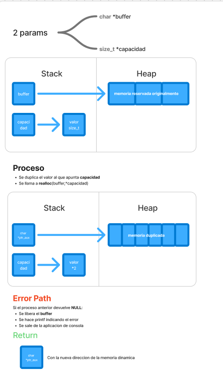

- **`creando_maloc(size_t size)`** → asigna memoria de manera segura, devuelve NULL en caso de error.

  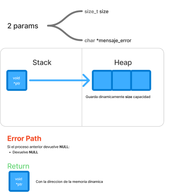

---

#### Funciones de Manejo de Archivos

- **`archivo_open(const char *nombre_archivo)`** → abre un archivo para lectura, devuelve NULL en caso de error.
- **`archivo_crear(const char *nombre_archivo)`** → crea un archivo para escritura, devuelve NULL en caso de error.
- **`leer_linea(FILE *archivo, size_t *capacidad)`** → lee una línea de un archivo CSV dinámicamente.
- **`escribiendo_linea(tp1_t *tp1, FILE *archivo)`** → escribe los Pokémon en un archivo CSV.

---

#### Funciones de Parseo y Validación

- **`parse_pokemon_validations(char *linea)`** → validaciones de linea.
- **`switch_pokemon(struct pokemon *p, int campo, const char *buffer)`** → asigna los valores de cada campo a la estructura Pokémon.
- **`parsear_pokemon(char *linea)`** → convierte una línea CSV en un `struct pokemon`.
- **`agregar_pokemon(tp1_t *tp1, struct pokemon *pk)`** → agrega un Pokémon al vector dinámico de `tp1_t`.

  

- **`tipo_a_string(enum tipo_pokemon tipo)`** → convierte el tipo de Pokémon a cadena.
- **`validando_formato_csv(const char *archivo)`** → valida que el archivo tenga extensión `.csv`..
- **`buscando_duplicados(tp1_t *tp1, struct pokemon *pk)`** → devuelve true si el pokemon ya se encontraba dentro del array dinamico.

---

### 2. `tp1.c` / `tp1.h`

Módulo que contiene las funciones provistas en la consigna.  
Aquí se definen:

- La estructura **`struct pokemon`**.
- La estructura **`struct tp1`**, que agrupa un vector dinámico de pokemones y su cantidad.
- Funciones base para inicialización y manejo de estas estructuras.

El archivo `tp1.h` actúa como **interfaz pública** para que otros módulos puedan usar estas funciones.

---

#### Funciones de Lectura y Escritura de Archivos

- **`tp1_leer_archivo(const char *nombre)`** → lee un archivo CSV y devuelve un `tp1_t` con los Pokémon cargados.
- **`tp1_guardar_archivo(tp1_t *tp1, const char *nombre)`** → guarda todos los Pokémon de `tp1_t` en un archivo CSV.

---

#### Funciones de Conteo

- **`tp1_cantidad(tp1_t *tp1)`** → devuelve la cantidad de Pokémon almacenados en `tp1_t`.

---

#### Funciones de Conjuntos

- **`tp1_union(tp1_t *un_tp, tp1_t otro_tp)`** → combina dos colecciones de Pokémon eliminando duplicados.

  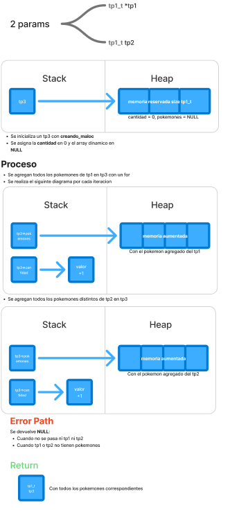

- **`tp1_interseccion(tp1_t *un_tp, tp1_t otro_tp)`** → devuelve los Pokémon comunes a ambos conjuntos.

  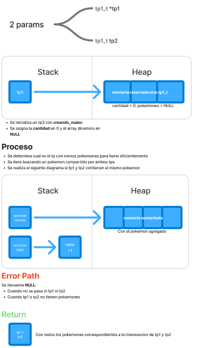

- **`tp1_diferencia(tp1_t *un_tp, tp1_t otro_tp)`** → devuelve los Pokémon que están en el primer conjunto pero no en el segundo.

  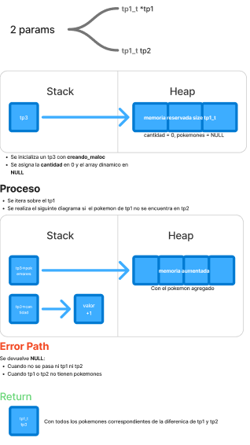

---

#### Funciones de Búsqueda

- **`tp1_buscar_nombre(tp1_t *tp, const char *nombre)`** → busca un Pokémon por nombre usando búsqueda binaria (ordenando previamente).
- **`tp1_buscar_id(tp1_t *tp, int id)`** → busca un Pokémon por ID usando búsqueda binaria (ordenando previamente).

---

#### Función de Iteración

- **`tp1_con_cada_pokemon(tp1_t *un_tp, bool (*f)(struct pokemon *, void *), void *extra)`**  
  Aplica una función `f` a cada Pokémon del conjunto, hasta que `f` retorne `false`. Devuelve la cantidad de iteraciones realizadas.

---

#### Función de Liberacion de memoria

- **`tp1_destruir`**  
  Libera toda la memoria asociada al tp1.

---

Estas funciones dependen de las utilidades definidas en `mis_funciones.c`

---

### 3. `main.c` / `funciones_main.h`

Es el **punto de entrada del programa**.  
Se encarga de:

- Validar los parámetros pasados por línea de comando.
- Mostrar el mensaje inicial si la ejecución no respeta el formato.
- Llamar a las funciones correspondientes según la operación pedida (`buscar`, `mostrar`, `union`, `interseccion`,`diferencia`).

## Tests Unitarios

Esta sección describe cómo se verifican todas las funciones del proyecto mediante pruebas unitarias.

### Objetivo

- Comprobar que cada función del proyecto se ejecute correctamente en distintos escenarios.
- Asegurar que las operaciones sobre las estructuras dinámicas (`tp1_t` y `struct pokemon`) se realicen sin errores de memoria.
- Validar la correcta lectura y escritura de archivos CSV.
- Confirmar que las funciones de búsqueda, ordenamiento y operaciones de conjuntos (unión, intersección, diferencia) devuelvan los resultados esperados.

### Cobertura de pruebas

Se realizan **76 pruebas unitarias** que incluyen:

- **Lectura de archivos CSV**: validar parseo correcto de líneas y manejo de errores.
- **Ordenamiento de Pokémon**: ascendente y descendente por nombre e ID.
- **Operaciones de conjuntos**: unión, intersección y diferencia entre listas de Pokémon.
- **Búsqueda**: por nombre e ID.
- **Funciones auxiliares**: `resize_buffer()`, `creando_maloc()`, `tipo_a_string()`, y más.

### Compilación y ejecución de tests

Para compilar los tests:

```bash
gcc pruebas_alumno.c src/*.c -o tests
```

Para ejecutar los tests:

```bash
./tests
```

## Respuestas a las preguntas teóricas

### 1. Elección de la estructura

Para implementar la funcionalidad pedida, se eligió la siguiente estructura principal:

```c
struct tp1 {
    struct pokemon *pokemones; // Vector dinámico de Pokémon
    size_t cantidad;            // Cantidad de Pokémon en el vector
};
```

### 2. Diagramas

Podés ver el diagrama completo en FigJam en el siguiente enlace de asi desearlo:  
[Abrir diagrama en FigJam](https://www.figma.com/board/vowX8Y9YeQB6TmmbxEd99t/TP1?node-id=0-1&t=AGoofdv76DWUrmTd-1)
Hay 2 diagrmas:
✅Diagrma de flujo
✅Diagrama de memoria y estructura

### 3. Complejidad computacional de las funciones (`tp1.c`)

- **`tp1_leer_archivo`** → O(n)

  - Se itera línea por línea del archivo CSV, donde n es la cantidad de registros.

- **`tp1_guardar_archivo`** → O(n)

  - Se recorre todo el vector de Pokémon para escribir cada registro.

- **`tp1_union`** → O(n^2)

  - Para cada Pokémon del segundo vector se compara con los del primero para evitar duplicados, siendo n y m las cantidades de cada vector.

- **`tp1_interseccion`** → O(n^2)

  - Se compara cada Pokémon del vector más pequeño con todos los del más grande.

- **`tp1_diferencia`** → O(n^2)

  - Para cada Pokémon del primer vector se busca coincidencia en el segundo vector.

- **`tp1_buscar_nombre`** → O(n log n)

  - Primero se ordena el vector alfabéticamente (O(n log n)) y luego se realiza búsqueda binaria (O(log n)).

- **`tp1_buscar_id`** → O(n log n)

  - Similar al anterior: ordenar por id + búsqueda binaria.

- **`tp1_con_cada_pokemon`** → O(n)
  - Se recorre todo el vector hasta que la función callback retorne false.

**Nota:** n corresponde a la cantidad de Pokémon en `tp1->cantidad`.

---

### 4. Dificultades en la implementación del `main`

Al principio me costó comprender completamente las consignas y cómo organizar todo de manera funcional dentro de una aplicación de consola.  
Sin embargo, trabajando función por función y luego integrándolas, con sus respectivas validaciones, logré desarrollar un flujo correcto y robusto.

Las dificultades principales fueron:

- Asegurar que todas las validaciones de parámetros funcionen correctamente antes de ejecutar la operación.
- Manejar memoria dinámica de manera segura y consistente.
